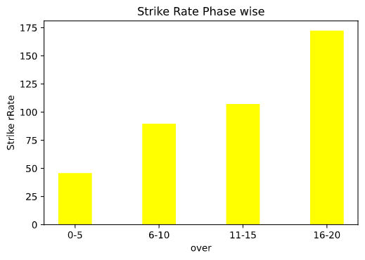
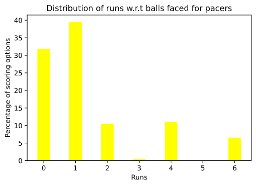
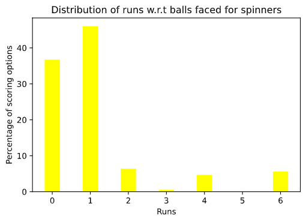
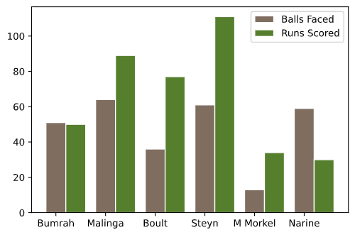
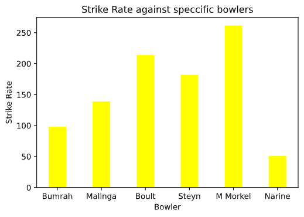
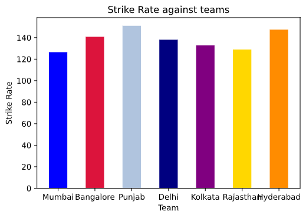

# Welcome!
This is a fun exercise analysis on MS Dhoni using Pandas, Matplotlib and seaborn

**What is MS Dhoni&#39;s strike rate transition in 5 over intervals?**

**Above demonstration in terms of runs scored w.r.t balls faced**

- In the 1st 10 overs he usually comes if there is early fall of wickets and tries to analyse the opponent.
- Between over 11-15, he starts improving the strike rate and scoring briskly.
- Between over 16-20, he has scored most runs of his career at an strike rate of 172+. Clearly, you don&#39;t want him to stay till the end of the innings.

# **What are MS Dhoni&#39;s scoring options against pacers?**

- He has scored nearly 50% of his runs against pacers by running between the wickets indicating his fitness and ability to rotate strike at ease.
- He has scored more 4s than 6s suggesting low risk percentage.

**What are MS Dhoni&#39;s scoring options against spinners?**

- Dot ball percentage is higher compared to pacers
- He has scored more boundaries in 6s compared 4s, indicating relatively higher risk percentage compared to pacers. But someone of his ability

**Do spinners perform better against MS Dhoni or pacers?**

- Clearly Dhoni has a better strike rate against pacer.
- Spinners perform relatively better to build pressure against Dhoni.

**How does MS Dhoni perform against key bowlers of other teams?**

- Dhoni has performed exceedingly against top bowlers like Steyn, Morne Morkel, Boult, Malinga.
- Bumrah has done fairly well in containing Dhoni while Sunil Narine has been pick among bowlers in addressing the **best finisher.**

**What is his strike rate against the same set of bowlers?**

**What is MS Dhoni&#39;s strike rate against different teams in IPL?**

- Dhoni&#39;s strike rate suggests he is the reliable basher against all the teams but has been clinical against Bangalore, Punjab and Hyderabd.

# **Statistics give us a measure of Dhoni&#39;s ability but they don&#39;t convey the whole story in the field…**

# **Dhoni&#39;s legacy is beyond stats…**

